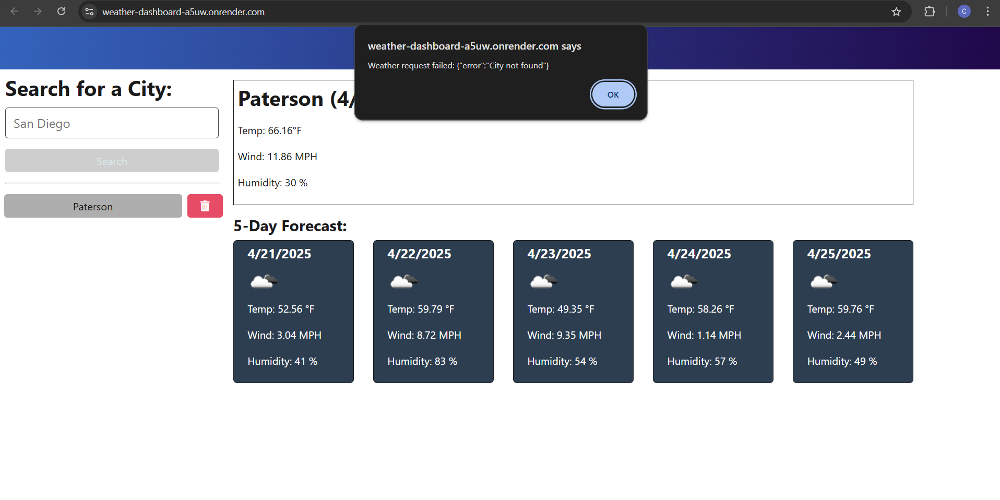

# 🌦️ Weather API

# 🌦️ Weather API


A sleek and responsive full-stack weather dashboard built with **TypeScript**, **Express**, **Vite**, and the **OpenWeatherMap API**. Users can search for any city to instantly view its current weather conditions and a 5-day forecast. Searched cities are saved in a history panel and can be revisited or deleted.

---

## 📑 Table of Contents

- [Installation](#installation)
- [Usage](#usage)
- [License](#license)
- [Contributing](#contributing)
- [Tests](#tests)
- [Screenshots](#-screenshots)
- [Questions](#questions)

---

## 🚀 Installation

1. **Clone the repository**

   ```bash
   git clone git@github.com:Calebfeliciano/weather-dashboard.git
   cd weather-dashboard
   ```

2. **Install dependencies**

   ```bash
   npm install
   ```

3. **Run locally**

   ```bash
   npm run start:dev
   ```

> This starts the backend server on port `3001` and the frontend (Vite) on `http://localhost:3000`.

---

## 🔧 Usage

- Type a **city name** into the search bar and click **Search**
- View the **current weather** and **5-day forecast** for that city
- Recently searched cities are saved in the **search history**
- Click a history item to reload its weather
- Click the 🗑️ icon next to a history item to remove it
- Invalid cities show a friendly error alert
- Weather data is retrieved from the OpenWeatherMap API

👉 **Live App:** [https://weather-dashboard-a5uw.onrender.com](https://weather-dashboard-a5uw.onrender.com)

---

## 📄 License

This project is licensed under the [MIT License](https://opensource.org/licenses/MIT).

---

## 🤝 Contributing

Contributions are welcome! To get started:

1. Fork the repository
2. Create a new branch:

   ```bash
   git checkout -b your-feature-name
   ```

3. Commit your changes with clear messages
4. Push your branch:

   ```bash
   git push origin your-feature-name
   ```

5. Open a **Pull Request** and describe your changes

---

## 🧪 Tests

While no automated tests are implemented yet, you can manually test the app by:

- Searching for real cities in the input bar
- Attempting to search for invalid cities (error alerts)
- Ensuring previously searched cities show up in history
- Clicking or deleting history items

---

## 📸 Screenshots

### 🔍 Search for a City


### 📊 Display Results


### ❌ Handle Invalid City



### 🕘 Persistent History


---

## ❓ Questions

If you have any questions or feedback, feel free to reach out:

- GitHub: [Calebfeliciano](https://github.com/Calebfeliciano)
- Email: [Caleb.feliciano11@gmail.com](mailto:Caleb.feliciano11@gmail.com)

